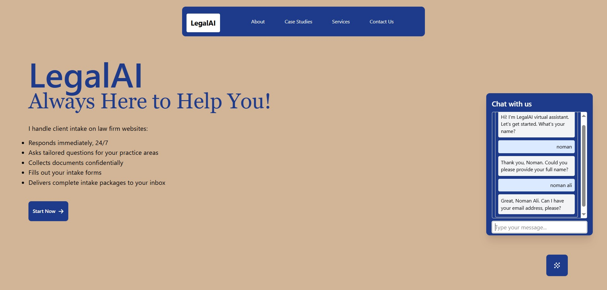

## Automated Law Firm Intake - Frontend  
[](https://github.com/MM-WA/automatedLawFirmIntake-server)

This is the frontend of a law firm website having a chatbot on landing page to collect initial information from clients and send that information to the lawyers automatically through email.  



### Features  
- Helps Law firm to intake new client 

### Setup Locally
**1.** Clone the project
```bash
git clone https://github.com/MM-WA/automatedLawFirmIntake-client.git
```
**2.** Move to the project directory
```bash
cd automatedLawFirmIntake-client
```
**3.** Install dependencies
```bash
npm install
```

### Configuration  
Before running the project create `.env` in root directry and provide following keys  
```env
VITE_SERVER_BASE_URL = http://localhost:8000
```


### Run the Server
```bash
npm run dev
```

### Author
Mian Muhammad Waleed Asif
